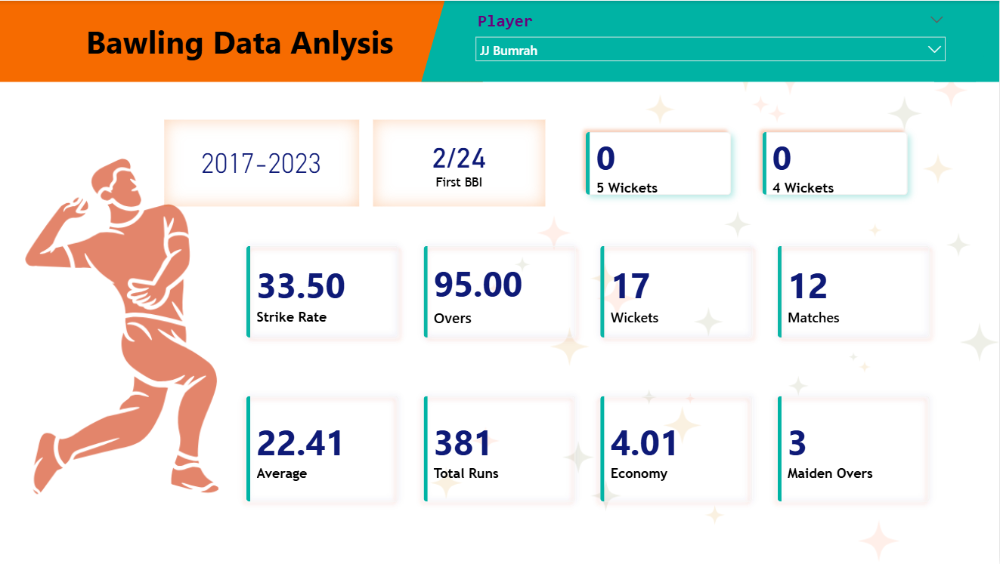

# 🏏 ESPN Cricket Data Analysis (Power BI)

## 📌 Overview
This Power BI dashboard analyzes **India vs South Africa** cricket performance with
a focus on **Batting, Bowling, and Fielding** metrics.

## 📊 Report Pages
- Batting Analysis
- Bowling Analysis
- Fielding Analysis

## 📷 Dashboard Screenshots

### 🏏 Batting Analysis

### 🎯 Bowling Analysis

### 🧤 Fielding Analysis

## 🛠 Tools & Skills Used
- Power BI
- DAX (RANKX, TOP N, Measures)
- Data Modeling
- Data Visualization

## 👩‍💻 Author
Vaishnavi
