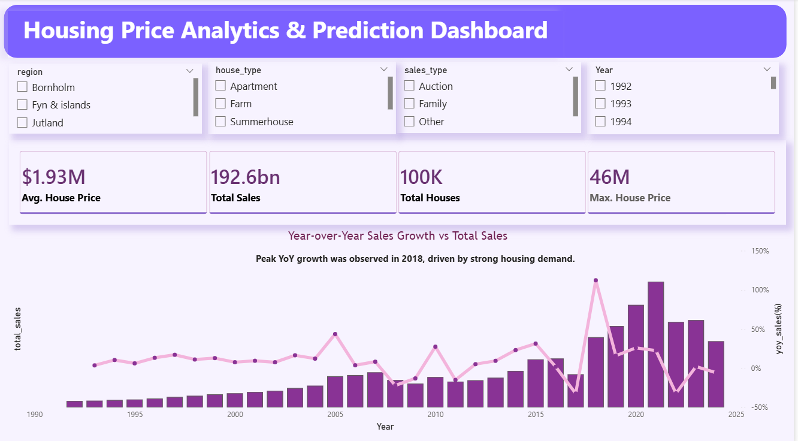
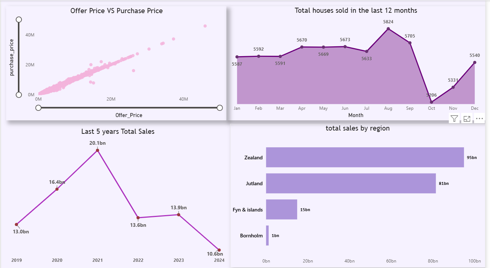
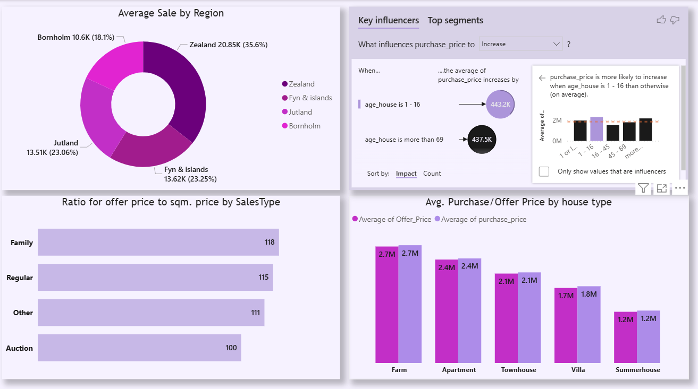

# 🏠 Denmark Housing Market Analysis (1992–2024)

## 📌 Project Overview
This project analyzes residential housing data from Denmark between **1992 and 2024** to understand long-term price trends, 
regional differences, and key market drivers.

## 📸 Dashboard Preview

### 🔹 Overview Page

### 🔹 Second Page

### 🔹 Last Page

## 👩‍💻 Author

**Vaishnavi Ghadge**  
Power BI Developer | Data Analyst  

🔹 Skilled in data visualization, dashboard development, and business analytics  
🔹 Passionate about transforming raw data into actionable insights  

