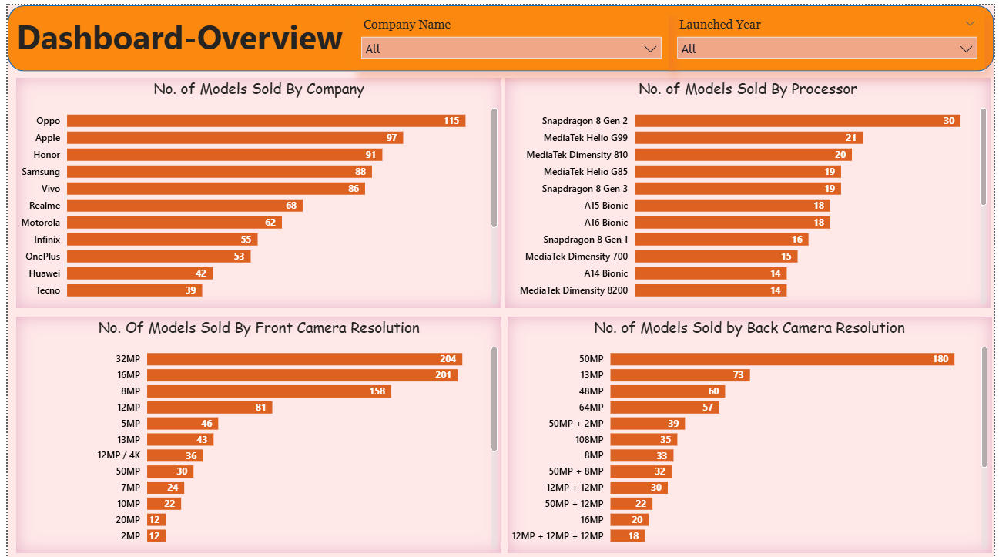
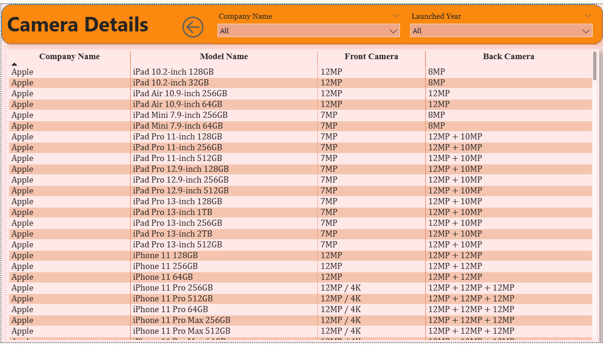
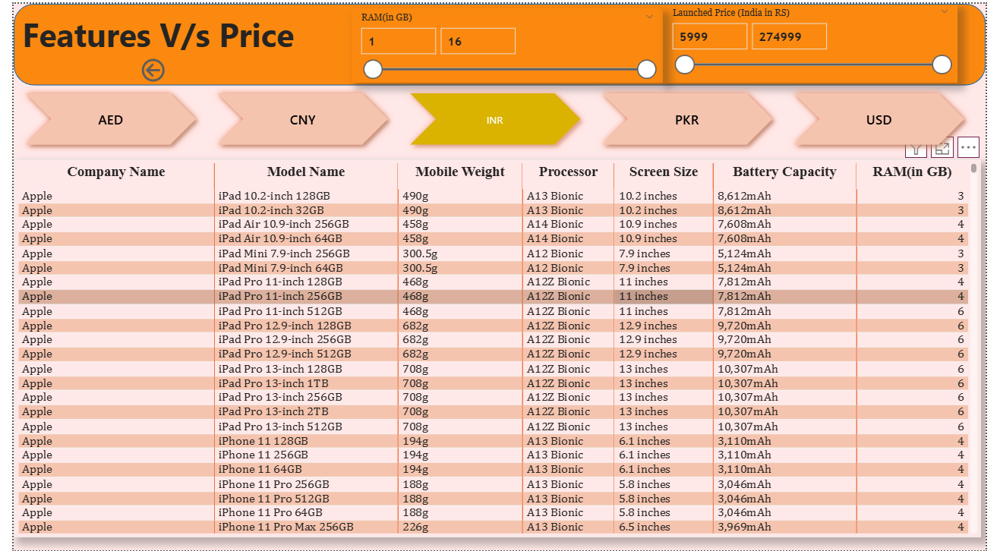

# 📱 Mobile Data Analysis Dashboard (Power BI)

## 📌 Project Overview
This project focuses on analyzing mobile phone data to understand the relationship between **price, features, and brands** using interactive Power BI dashboards.

The dashboard helps users explore how different specifications like camera, company, and model affect mobile pricing and performance.

---

## 🎯 Objectives
- Analyze mobile phone pricing based on features
- Compare front and back camera specifications across models
- Study company-wise pricing and feature trends
- Provide interactive insights using drill-through and bookmarks

---

## 📊 Dashboard Features

### ✅ 1. Price vs Features Analysis
- Bar charts showing:
  - Price vs Front Camera
  - Price vs Back Camera
  - Price vs Model Name
  - Price vs Company Name

### ✅ 2. Model & Company Comparison
- Comparison of mobile models based on:
  - Camera quality
  - Brand
  - Price range

### ✅ 3. Feature vs Price Insights
- Visual analysis of how features impact mobile prices
- Identification of high-value models

### ✅ 4. Drill-Through Pages
- Detailed view for each selected model
- Navigate from overview to detailed insights

### ✅ 5. Bookmarks & Navigation
- Interactive bookmarks for:
  - Easy navigation
  - Switching views
  - Better user experience

---

## 🛠 Tools & Technologies Used
- Power BI Desktop
- Microsoft Excel / CSV (Data Source)
- Data Modeling & DAX (Basic Measures)
- Power Query (Data Cleaning)

---

## 📂 Dataset Information
The dataset contains information such as:

- Model Name  
- Company Name  
- Price  
- Front Camera  
- Back Camera  
- Processor  
- RAM / Storage  
- Other Mobile Features  

(Data used for learning and analysis purposes)

---

## 📷 Dashboard Screenshots

## Camera Insights(Using Drill Through)

## Pricing by different (Using Bookmarks)

## Features vs Price by diff. Countries (Using Bookmarks)
 
> Add your dashboard screenshots here:
## 👩‍💻 Author

**Vaishnavi Ghadge**  
Power BI Developer | Data Analyst Aspirant  

📍 India  
📧 (Add your email if you want)  
🔗 GitHub: (Add your GitHub link)
